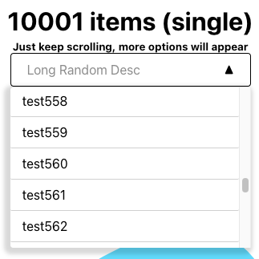

# Hive Take-Home Assignment

## Set Up

Install dependencies for ReactJS
```bash
$ npm install
```

## Running demo

Run demo of dropdown menu. Displays both single and multiple selection options
```bash
$ npm start
```

## Features
- Dropdown menu based on input list with menu drawing over other components
- Support single and multiple selection methods
- Auto-collapse when clicking off dropdown menu
- Ability to select all or deselect all based on how many items are selected
- Add a description to contextualize dropdown menu
- Selected items will be shown in the description area
- Autocut description if string is too long
- Optimized render using infinite scrolling based on React hook for rendering thousands of items

## Images

### Demo Website


### Single Selection Mode with 4 items


### Multiple Selection Mode with 4 items


### Single Selection Mode with 10001 items




### Multiple Selection Mode with 10001 items

